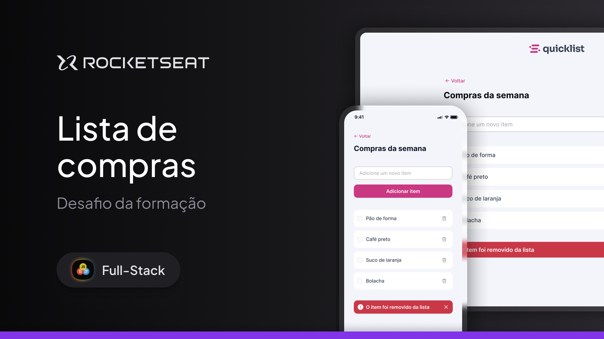

# Desafio Quicklist

  
    

## Sobre:

Desafio desenvolvido durante a formação Full Stack da Rocketseat.

O Quicklist permite os usuários criarem uma lista de compras de forma rápida e intuitiva, podendo marcar o que já compraram ou remover o que não precisará mais.

O desafio foi realizado seguindo os tópicos aprendidos no módulo [Javascript Básico](https://github.com/ayresrouxio/rocketseat-javascript-basico)

## Tecnologias:

- Figma;
- HTML e CSS;
- Javascript;

## Tópicos:

- HTML e CSS;
- Manipulação do DOM;
- Eventos;
- Funções;
